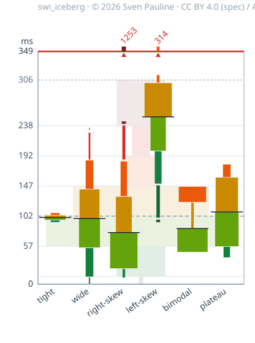

# swi_iceberg

**Compare many distributions side by side — one swi_iceberg per object.**



*Six example objects (simulated response latency, milliseconds), each a deliberately
extreme shape. Each column is one swi_iceberg; the faint shape behind them is every object
pooled together. The value axis is clipped to the pooled reference, so an object whose
samples run past the ceiling is marked at the roof with a caret and its raw maximum
(e.g. `1253`).*

**Same fleet, interactive:** pan, vertical zoom, per-band tooltips, median / max / min
overlay curves, a raisable roof clip, view toggles, and a "Random fleet" button that swaps
in another pre-computed fleet —
<https://swi-iceberg.swi-energy.com/fleet/>

---

## Why swi_iceberg?

A histogram is excellent for understanding the distribution of a single object. But when you need to compare many objects at once, the picture quickly becomes crowded: five histograms may still be manageable, but with dozens or hundreds of distributions, you lose the overview.

**swi_iceberg is designed for the fleet, not just the individual object.**

Each `swi_iceberg` is a compact graphical representation of one distribution. Multiple objects can then be arranged side by side on a shared value axis to form an **iceberg fleet**.

The real power of swi_iceberg appears at this level.

A fleet can display **dozens or hundreds of distributions simultaneously**, while preserving a common statistical scale and an immediate view of how each object relates to the others. A pooled **sky** provides the baseline — a visual representation of the overall population against which every individual iceberg can be compared.

Instead of asking the reader to inspect one histogram after another, the fleet makes patterns visible at a glance:

* Where is each object's center relative to the fleet baseline?
* Which objects are systematically higher or lower?
* Which distributions are concentrated or widely spread?
* Where are the heavy tails?
* Which objects behave differently from the rest of the fleet?
* Are there groups or outliers that would be difficult to notice when viewing distributions individually?

The individual `swi_iceberg` is therefore only the basic building block. **The fleet is the visualization. The sky provides the reference.**

This makes swi_iceberg particularly suited to problems where the question is not simply *"What does this distribution look like?"*, but rather:

> **"How do hundreds of distributions compare with each other, and where does each one sit relative to the overall population?"**

The design uses robust statistical coordinates based on the median and MADN, while preserving the observed distribution through separate visual encodings for population and occupied value range.

## How to read the picture

### (Using response latency as a running example — any measured quantity works)

| What you see | What it means |
|---|---|
| Vertical position | The absolute measured value — any unit (ms in this example). Objects float at their own level. |
| Band color (green → red) | Which MADN band: low → high. |
| Band **width** | Share of that object's samples in the band. |
| Band **height** | The value range those samples actually span. |
| Solid black line | That object's median. |
| Dashed line | Median of all objects pooled (the global reference). |
| Faint background | The pooled distribution, drawn with the same rules. |
| Dark green cap below the body | **Seat pad** — samples below −3 MADN (the low tail). |
| Dark red cap above the body | **Topping** — samples above +3 MADN (the high tail). |
| Short dark red bar above the roof line | **Roof carpet** — the topping's continuation, drawn when the object's raw maximum passes the pooled clip (§9). |
| Red top or bottom border | Some pooled samples lie beyond the global clip ("shoot through the roof/floor"). |
| Red caret + number at the roof | That object's raw maximum exceeds the clip, and by how much. |
| Curve leaving the top edge | An overlay-curve value above the visible window — drawn open-ended, never pinned flat to the roof. The median curve labels its peak; the max curve does not (the row above already labels that maximum). |

An empty gap between bands means *no* samples there; a thin sliver means *a few*.
Two fat blocks joined by a thin waist (see `bimodal`) is a two-mode distribution.

## How a swi_iceberg relates to the underlying distribution

Each panel below shows one of the six example objects twice, on the same value
axis: its **sample histogram** (left, count growing to the right) and its
**swi_iceberg** (right). The six objects deliberately cover different, extreme
distribution shapes so you can see how each shape maps onto the swi_iceberg.


Reading the pairs:

- **Tight vs wide** — both symmetric and unimodal, but the tight one is peaked and
  light-tailed (a clean diamond: everything inside the envelope, no tail caps) while the
  wide Gaussian spreads smooth tails that leak into the outer bands and the topping cap.
  On the shared fleet axis the wide one also stands much taller: spread makes a
  swi_iceberg taller, not wider.
- **Right skew** — mass low with a tail upward: wide green/amber low bands plus a
  red topping cap.
- **Left skew** — the mirror image: wide upper bands plus a dark-green seat pad.
- **Bimodal** — two histogram clusters: two fat blocks joined by a thin waist where the
  band between the modes is nearly empty.
- **Near-uniform (plateau)** — a flat histogram with hard cliffs at both ends: evenly
  sized bands and no tails, where the wide Gaussian tapers off smoothly.

## Install and use

Requires Python 3.10+ and NumPy (the only runtime dependency; pandas is **not**
required, though array-likes such as a pandas Series work fine).

```bash
pip install -e .
```

```python
import numpy as np
from swi_iceberg import build_iceberg, to_json

values = np.random.default_rng(0).normal(100, 15, 1500)   # any array-like, n >= 100
g = build_iceberg(values)

g.median, g.madn          # robust center and scale
g.population              # per-band sample counts (low -> high), width encoding
g.band_lo, g.band_hi      # observed value range inside each band, height encoding
g.topping, g.bottoming    # topping / seat pad: samples retained beyond +3 / -3 MADN
to_json(g)                # plain-JSON handoff payload for your own renderer
```

Fewer than 100 samples raises `InsufficientDataError`; if over half the samples are
identical (MADN = 0) the swi_iceberg collapses to a single line at the median instead of
inventing spread.

## What's in this repository

| Path | Contents |
|---|---|
| [`specification_swi_iceberg.md`](specification_swi_iceberg.md) | The **statistical design specification** of the iceberg fleet (CC BY 4.0): the numbers, formal definitions, invariants, and edge cases. |
| [`specification_swi_iceberg_visual.md`](specification_swi_iceberg_visual.md) | The **visual (display) specification** (CC BY 4.0): how those numbers are drawn — geometry, colour, clipping, roof marking, background, interaction. |
| [`docs/swi_iceberg_User_Manual.md`](docs/swi_iceberg_User_Manual.md) | **User manual**: package API, streaming feed, wait-out pipeline, and the verification harness, with screenshots. |
| [`src/swi_iceberg/`](src/swi_iceberg/) | Reference implementation (Apache-2.0): statistical + rendering layers. |
| [`docs/figures/`](docs/figures/) | Example graphics. |
| [`docs/fleet/`](docs/fleet/) | The interactive fleet page as published to GitHub Pages (built, self-contained static files; the harness source that generates it is local tooling). Live at <https://swi-iceberg.swi-energy.com/fleet/>, with a landing page over [`docs/`](docs/) at <https://swi-iceberg.swi-energy.com/>. |
| [`CITATION.cff`](CITATION.cff) | Canonical citation (DOI reserved until Zenodo publication). |

Tests, the browser verification harness source, and the sample-data generators are
local tooling and are intentionally **not** part of this published tree; only the
page they build is published, under [`docs/fleet/`](docs/fleet/).

## Provenance, license, citation

- Introduced by **Sven Pauline**, 2026; associated with **Sheer Will Industry (SWI)**.
- Specification text and figures: **CC BY 4.0** ([LICENSE](LICENSE)).
- Executable code: **Apache-2.0** ([LICENSE-CODE](LICENSE-CODE)).
- Suggested attribution: *swi_iceberg — © 2026 Sven Pauline (copyright owner),
  associated with Sheer Will Industry (SWI). Used under CC BY 4.0.*
- Cite as: Pauline, Sven (2026). *swi_iceberg: A Robust Six-Band MADN Visualization
  for the Iceberg Fleet*, v1.1 — see [CITATION.cff](CITATION.cff).

Three documents, deliberately separate: the
[statistical specification](specification_swi_iceberg.md) defines the numbers and
invariants (language-agnostic), the
[visual specification](specification_swi_iceberg_visual.md) defines how they are
**drawn** (geometry, colour, clipping, roof marking, background, interaction), and the
[user manual](docs/swi_iceberg_User_Manual.md) defines how to use the software package.
For the full formal treatment — zone definitions, conservation invariants, clipping
rules, degenerate cases, and relation to prior work — read the specifications. This
README is only a friendly front door.
