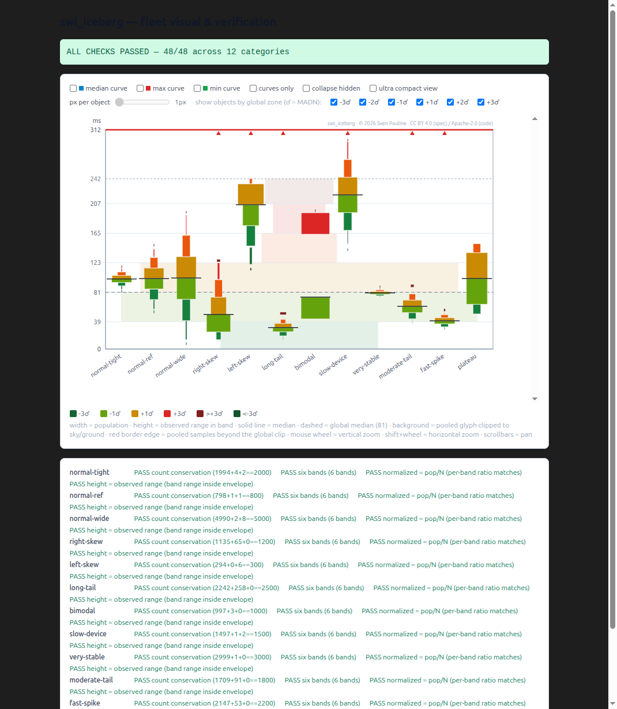
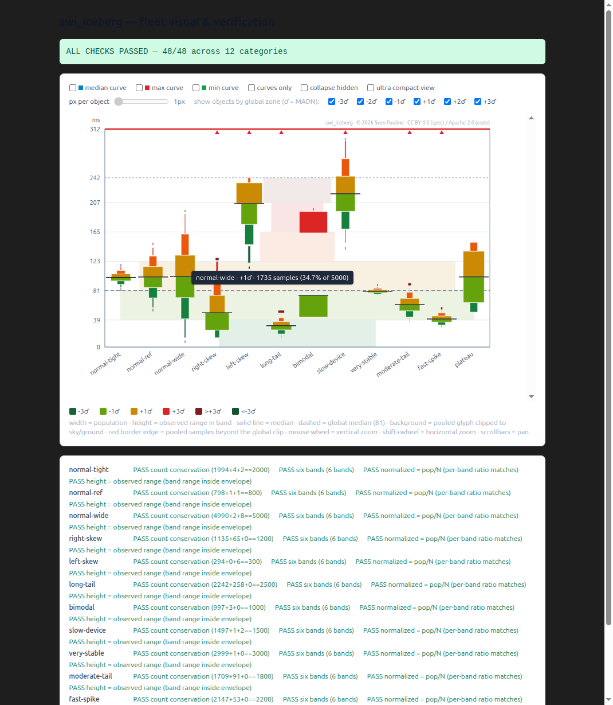
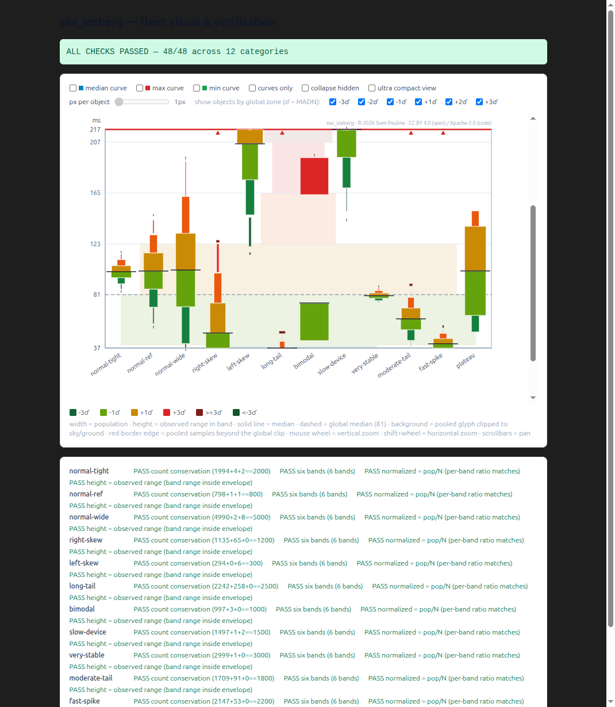
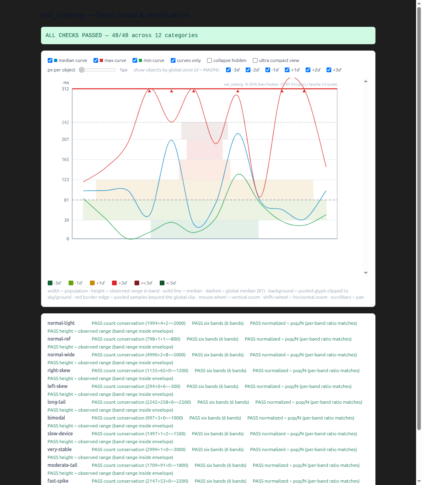
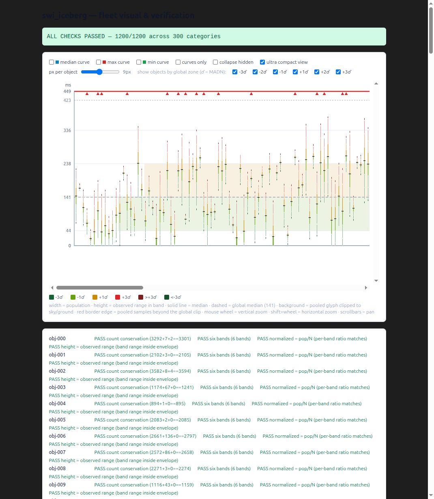
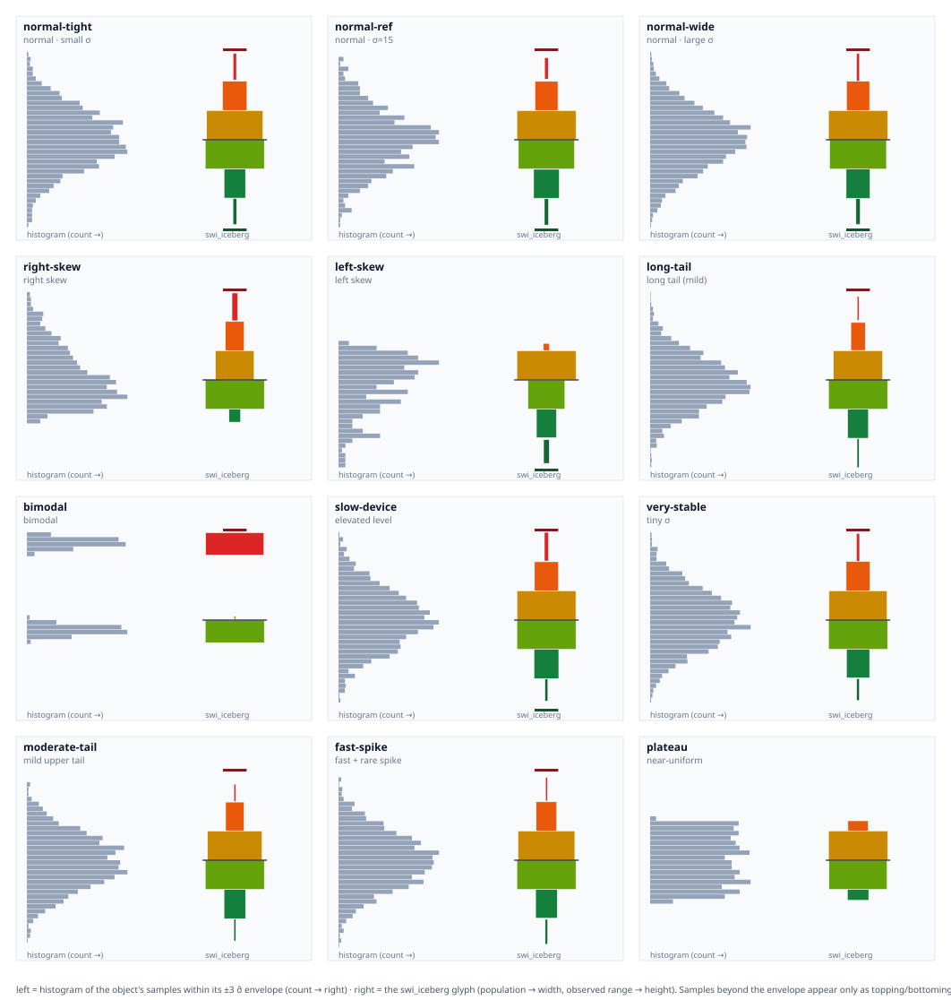

# swi_iceberg — User Manual

**Software package usage · version 1.0**

**Package:** `swi_iceberg` (Python 3.10+, NumPy; no other runtime dependency)
**Code license:** Apache-2.0 ([LICENSE-CODE](../LICENSE-CODE))
**Design specification:** [specification_swi_iceberg.md](../specification_swi_iceberg.md)
(CC BY 4.0) — the *iceberg fleet* design lives there; this manual covers only how to
use the software.
**Verification harness:** `private/verify` (local tooling, not published).

---

## 1. Install

```bash
pip install -e .            # from the repository root
# or, in the project's conda environment:
conda run -n pktbuild pip install -e .
```

```python
from swi_iceberg import build_iceberg, IcebergFeed, IcebergPipeline
from swi_iceberg import to_ascii, to_json, to_raster, global_zone_index
```

---

## 2. Batch API: `build_iceberg`

```python
glyph = build_iceberg(values, resolution=1.0, z_min=-3.0, z_max=3.0)
```

| Argument | Meaning | Default |
|---|---|---|
| `values` | any array-like of numbers (signed domains allowed) | — |
| `resolution` | band width in MADN (σ̂) units | `1.0` → six bands over ±3 |
| `z_min`, `z_max` | clipping envelope in MADN units | `-3.0`, `3.0` |

Returns an immutable `IcebergGlyph`:

| Field | Meaning |
|---|---|
| `n` | sample count |
| `median`, `madn` | robust center and scale (MADN = 1.4826 · MAD) |
| `population` | uint32 counts per band, low → high (**width** encoding) |
| `edges` | band edges in MADN units (len = bands + 1) |
| `band_lo`, `band_hi` | observed value range inside each band (**height** encoding); NaN when a band is empty |
| `lower`, `upper` | absolute ±3 MADN envelope |
| `topping`, `bottoming` | retained counts beyond +3 / −3 MADN |
| `mode`, `value` | `"collapsed"` and the median when MADN = 0 |
| `.normalized` | `population / n` |

Errors: `InsufficientDataError` below 100 samples; `ValueError` for non-positive
resolution or `z_max <= z_min`.

```python
>>> glyph.population
array([  43,  291,  666,  675,  280,   42], dtype=uint32)
>>> print(to_ascii(glyph))          # quick terminal view
```

---

## 3. Rendering helpers

- `to_ascii(glyph, width=40)` — dependency-free text rendering (bands high → low,
  run length ∝ population, observed range printed per band).
- `to_json(glyph)` — the canonical handoff payload (statistics only, no pixels):
  `mode, n, median, madn, resolution, z_min, z_max, lower, upper, edges, population,
  normalized, band_lo, band_hi, topping, bottoming, value, spec_version`.
  NaN ranges serialize to `null`. This is what the browser harness consumes.
- `to_raster(glyph, height_px, width_px)` — optional 2D bitmap (a render artifact).

---

## 4. Streaming feed: `IcebergFeed`

Initial batch, then **one value at a time**:

```python
feed = IcebergFeed()                 # resolution / z_min / z_max / min_samples
feed.feed_batch(first_samples)       # must reach >= 100
feed.feed_one(new_value)             # incremental update, arrival order
feed.ready, feed.n                   # state
feed.median                          # exact, O(1), no floating-point accumulation
feed.madn                            # exact, recomputed on demand
glyph = feed.glyph()                 # InsufficientDataError below 100
feed.reset()                         # fresh window
```

Numerical stability: the median is maintained as an **order statistic** (sorted
container), so it is exact with no running-sum drift — the incremental analogue of
Welford's algorithm for the mean. MADN and the band binning depend on the current
median, so they are recomputed exactly on demand instead of accumulated.

---

## 5. Wait-out pipeline: `IcebergPipeline`

Batches of **1..N** samples, processed after a **2-second wait-out** (configurable),
no matter how many accumulated:

```python
pipe = IcebergPipeline(flush_interval=2.0)   # default 2 s
pipe.start()                                 # background wait-out flusher
pipe.submit(single_value)                    # N = 1
pipe.submit(batch_of_any_size)               # N = many
pipe.submit(values, reset=True)              # reset parameter: fresh window first
pipe.flush()                                 # manual flush on demand
pipe.pending, pipe.n, pipe.batches_processed
glyph = pipe.glyph()                         # processed state (flush first to include pending)
pipe.reset(); pipe.stop()
```

Updates are incremental (sorted-insert into the order statistics); a flush processes
whatever is buffered, even a single sample.

---

## 6. Zone helper

```python
global_zone_index(value, median, madn)   # 0..5 for the six pooled σ̂ bands, None beyond ±3
```

Used by the harness for the per-zone show/hide toggles.

---

## 7. The verification harness (iceberg fleet viewer)

Local tooling under `private/verify` (Vite + TypeScript + Tailwind, SVG output).

```bash
conda run -n pktbuild python private/examples/gen_devices.py            # 12-object set
conda run -n pktbuild python private/examples/gen_devices.py --count=300 --out=devices300.json
cd private/verify && npm install && npm run dev        # http://localhost:5178
# alternate dataset:  http://localhost:5178/?data=devices300.json
```

### 7.1 Default iceberg fleet (12 objects)



Each column is one swi_iceberg on a shared absolute axis: band **width** = population
share, band **height** = observed value range, solid line = object median, dashed =
global median, faint bands = pooled reference clipped to the sky/ground envelope
(3 × global median), red carets at the roof = objects whose raw samples shoot through.

### 7.2 Tooltips

Hovering any object column shows object · zone (σ̂) · sample count · percentage of
that object's total (topping/bottoming beyond ±3 σ̂). Hit-tested per column, so it
works at any density.



### 7.3 Vertical zoom and panning

Mouse wheel = vertical zoom (anchored at the cursor); the vertical scrollbar pans
the zoomed window; roof/floor axis readings follow the visible window.



### 7.4 Curves only

Toggle **median / max / min curves** independently, and **curves only** to hide the
objects (slots preserved, never collapsed) leaving the waves, background, and roof
markers.



### 7.5 Ultra compact view (large fleets)

The **px per object** slider (1–18) sets horizontal density; the normal
width-encoded rendering scales to the slot — 18 px equals the compact view, 1 px
degenerates to spines (~18× denser). Shift+wheel = horizontal zoom; the horizontal
scrollbar pans.



### 7.6 Exporting figures

```bash
node private/examples/render_figure.mjs private/verify/public/devices.json out.svg \
     [--median-curve] [--collapse-hidden] [--vzoom=<f>] [--compare]
```

`--compare` produces the histogram-vs-swi_iceberg comparison grid used in the README:



---

## 8. Tests

```bash
conda run -n pktbuild python -m pytest private/tests -q
```

Covers the statistical invariants (median/MADN, six bands, count conservation,
observed-range-within-envelope, zero-MAD collapse, <100 rejection), the streaming
feed (streamed == batch), and the pipeline (1..N batches, wait-out flush,
incremental equality, reset).

---

## 9. License

Executable code: **Apache-2.0** ([LICENSE-CODE](../LICENSE-CODE)).
Specification text and figures: **CC BY 4.0** ([LICENSE](../LICENSE)).
