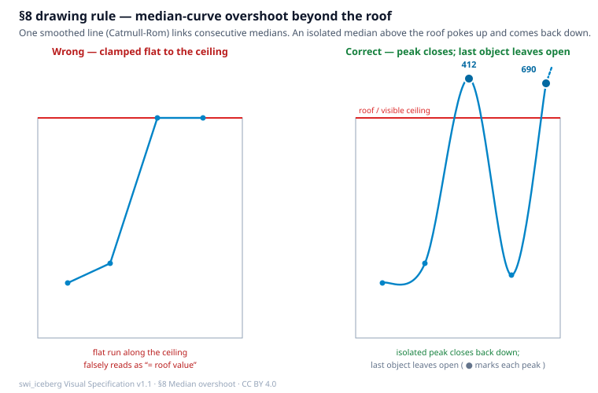
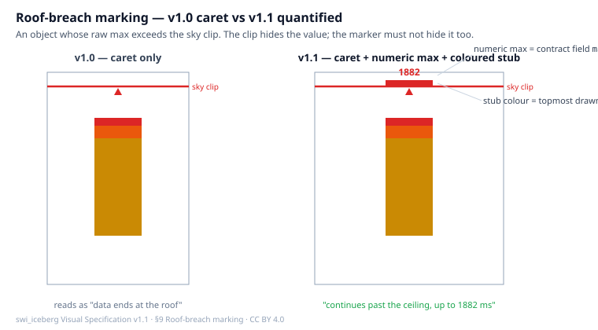

# swi_iceberg — Visual Specification

## A Normative Rendering and Interaction Contract for the Iceberg Fleet

**Design specification — version 1.1 (display model)**

**Introduced by:** Sven Pauline
**Year:** 2026
**Copyright:** © 2026 Sven Pauline. Associated with Sheer Will Industry (SWI).
**License:** Creative Commons Attribution 4.0 International (CC BY 4.0)
**Status:** Canonical rendering / interaction specification (language-agnostic, publishable)
**Companion document:** [specification_swi_iceberg.md](specification_swi_iceberg.md) — the
**statistical model** (version 1.1). This document is the **display model**; the two
together are the complete swi_iceberg specification.
**Software usage:** [docs/swi_iceberg_User_Manual.md](docs/swi_iceberg_User_Manual.md) — how to
drive the package; not normative for rendering.

---

## 0. Scope, and why this document exists

The swi_iceberg is a **visual** specification: several of its "statistics" exist only
because a picture needs them. A band's *height* is the observed value range
(`band_lo`/`band_hi`) purely so the silhouette can carry occupied range; the
`topping`/`bottoming` counts exist purely so clipped tails can be drawn as caps. In a
mark like this, the statistical model and the rendering cannot be pulled fully apart.

Rather than pretend they separate, version 1.1 splits the specification along the seam
that *does* hold — the **handoff contract** — into three layers:

| Layer | Owns | Document | Mutability at v1.1 |
|---|---|---|---|
| **Statistical core** | median, MADN, band partition, population conservation, the ±3 MADN envelope, tail retention | [specification_swi_iceberg.md](specification_swi_iceberg.md) | **Frozen** — no number changes |
| **Handoff contract** | the `to_json` payload schema (the fields a renderer is allowed to read) | shared; §2 here | **Additive** — gains `min`, `max` |
| **Display model** | geometry, colour, clipping, roof marking, overshoot, background, interaction | **this document** | **New** — relocated + v1.1 additions |

This document **absorbs the visual sections** that lived in the statistical spec at v1.0
(§5 width consequence, §6 height, §7 display clipping, §8 medians, §9 colour, §10
background, §11 encoding table) and **adds the v1.1 display requirements** introduced by
the SCADA fleet view. A conforming renderer implements this document; a conforming
statistician implements the statistical document; the `to_json` payload is the only thing
they share.

### 0.1 Normative language

The words **SHALL**, **SHOULD**, and **MAY** carry their usual meaning. A **conforming
renderer** is one that satisfies every unqualified **SHALL** below. Rendering choices
marked **MAY** are optional affordances; the reference harness (`devices-svg.ts`)
implements all **SHALL** items and most **MAY** items.

---

## 1. Coordinate system and the shared axis

- **x-position** encodes the **object** — one category or entity in the fleet. The mark is
  domain-agnostic: an object may be a device, a cohort, a region, a wealth bracket, a
  service, or anything else that carries a distribution of a measured quantity. Objects are
  laid out left-to-right in a stable, meaningful order whose sort key is chosen by the
  application, not by this specification.
- **y-position** encodes the **absolute measured value** (milliseconds, currency, counts —
  whatever the quantity is) on **one axis shared by the whole fleet**. Every swi_iceberg
  floats at its own `median ± z·MADN` on that common scale (statistical §3.4, §14.6).
- The renderer SHALL NOT give each object its own vertical scale; the comparison the
  fleet exists to enable is destroyed the moment axes differ.

---

## 2. The handoff contract (v1.1)

The package's `to_json(glyph)` is the canonical payload — *"statistics only; no pixels."*
A conforming renderer SHALL read its picture from these fields and SHALL NOT recompute a
statistic that the payload already carries (recomputing invites a second implementation
of the model to drift from the first).

Fields at v1.1:

| Field | Meaning |
|---|---|
| `mode` | `"normal"` or `"collapsed"` (zero MADN) |
| `n` | sample count |
| `median`, `madn` | robust center and scale |
| `resolution`, `z_min`, `z_max` | band width and envelope in MADN units |
| `lower`, `upper` | absolute ±envelope (`median + z_min·madn`, `median + z_max·madn`) |
| `edges` | band edges in MADN units, length = bands + 1 |
| `population` | per-band counts, low → high — the **width** encoding |
| `normalized` | `population / n` |
| `band_lo`, `band_hi` | observed value range inside each band, `null` when empty — the **height** encoding |
| `topping`, `bottoming` | retained counts beyond `+z_max` / below `z_min` |
| `value` | collapsed-mode single value (equals `median`) |
| **`min`, `max`** | **NEW v1.1** — the object's raw sample extremes, retained so the renderer can detect a shoot-through the pooled summary cannot express (§9) |
| `spec_version` | the contract version the payload conforms to (`"1.1"`) |

> **`mode: "normal"` is not the Gaussian normal distribution.** "Normal" here means only
> the general case — a spread with a non-zero MADN — as opposed to `"collapsed"` (every
> sample identical, zero MADN). Nothing in the swi_iceberg math assumes any distribution:
> the center is the median and the scale is MADN (the normalized median absolute deviation).
> The `±1`, `±2`, `±3` band edges are **MADN units, not Gaussian standard deviations and not
> probability intervals**. MADN is *compared* to a Gaussian only because a reader already
> knows what "one sigma / three sigma" looks like; the bands stay honest for skewed,
> heavy-tailed, and multi-modal data (statistical §3.3).

**v1.1 change.** `min` and `max` move from a caller-side bolt-on into the payload.
They are trivially `min(values)` / `max(values)`; adding them changes no existing
statistic, but it lets every consumer drop its own recomputation and lets the roof
marker (§9) be defined purely from the contract.

`spec_version` is a **lockstep guard**: a renderer or bridge that pins a version SHALL
refuse to draw a payload whose `spec_version` disagrees, rather than silently rendering a
contract it does not understand.

---

## 3. Band geometry (relocated from statistical §5–§6)

Each object is a vertical stack of equal-width MADN bands (default six over ±3).

- **Width** of a band SHALL be its normalized population `population[k] / n`, drawn
  centered on the object's x-coordinate so width changes never shift the visual center.
- **Height** of a band SHALL span the **observed value range** of the samples inside it:
  from `band_lo[k]` to `band_hi[k]`, mapped through the shared y-scale. The band is *not*
  a fixed theoretical block.
- An **empty band** (`population[k] == 0`, `band_lo`/`band_hi` null) SHALL NOT be drawn.
  This is the sole intended source of a vertical **gap** between two adjacent bands: a gap
  means no sample's value falls in that range. A renderer MAY render an explicit gap
  marker instead of blank space, but blank is conforming.
- Fallback: if a band is non-empty but its observed range is unavailable, a renderer MAY
  fall back to the theoretical edges `median + edges[k]·madn` … `median + edges[k+1]·madn`.
  Under the reference statistics this never triggers (a non-empty band always has a real
  observed range), so it is a guard, not a behaviour.

**Reading a gap.** Because height is the observed range, the silhouette distinguishes
"clustered data with deserts between clusters" from "continuous spread." A renderer SHALL
NOT invent fill across an empty band to make a column look solid.

---

## 4. Colour (relocated from statistical §9)

A diverging green → amber → orange → red ramp keyed to band position, low (fast) to high
(slow). The reference palette, bottom-to-top:

```
#166534  #15803d  #65a30d  #ca8a04  #ea580c  #dc2626
 -3σ̂     -2σ̂      -1σ̂      +1σ̂      +2σ̂      +3σ̂
```

Tail caps use dedicated deep tones: `#14532d` (bottoming), `#7f1d1d` (topping).

**The palette is open.** The hues above are the reference choice; the *profiling* of each
zone — where a colour starts and ends, how many steps there are, and the exact values — is a
branding and accessibility decision, not part of the statistics. Any conforming renderer MAY
retune the ramp and the tail-cap tones to its own palette, provided the bottom-to-top
ordering still reads as low-to-high and the redundancy invariant below holds.

**Redundancy invariant:** colour SHALL never be the sole carrier of meaning — a band's
vertical position encodes the same deviation, so the mark stays readable in grayscale and
to a colour-blind reader.

---

## 5. Medians (relocated from statistical §8)

- **Object median**: a **solid** horizontal rule across the object footprint. Not a band;
  its width encodes no population.
- **Global (pooled) median**: a **dashed** horizontal line spanning the plot, with its
  numeric reading attached to the matching axis tick.

---

## 6. Display clipping and the tail caps (relocated from statistical §7)

The body is bounded by the ±3 MADN envelope. Observations beyond it do **not** stretch the
body; they are retained as **bottoming** (below) and **topping** (above).

- Each tail SHALL be drawn as a **fixed symbolic-height stub** anchored at the ∓3 boundary
  (the reference uses a 4-pixel cap just outside the envelope). Its vertical thickness is a
  rendering parameter and encodes nothing.
- The tail's quantitative encoding is **width alone** — `count / n`, same shared scale as
  the body bands. A wide topping therefore means "a large fraction of this object's samples
  sit far above the centre" without any single extreme value destroying the vertical scale.
- A tail region with zero population MAY be omitted.

This is **display clipping**, not deletion and not winsorization: the samples are neither
removed nor replaced by boundary values; they move into a width-encoded cap.

---

## 7. The sky/ground clip and the raisable roof multiple (v1.1)

The **pooled** background and the **visible value axis** are bounded by a global
sky/ground envelope, so one extreme cannot shoot through the plot and squash every mark:

```
sky   = min( clipMultiple × pooled_median , pooled_max )
ground = max( −clipMultiple × pooled_median , pooled_min )
```

- **v1.0** fixed `clipMultiple = 3`. **v1.1** a conforming fleet renderer **MAY** expose
  `clipMultiple` as a control (the reference SCADA view allows 3–10). Raising it lifts the
  roof, the axis, and the shoot-through threshold **together**, so a long-tailed fleet can
  be opened up without breaking the "one extreme cannot stretch the scale" rule.
- **Signed domains.** A value can be negative whenever the measured quantity is *relative to
  a chosen reference point* — as in physics, "before/after" or "above/below" is meaningful
  only with respect to a frame, and changing the frame can flip a sign (a latency measured
  against a clock that runs ahead goes negative). When the pooled minimum is negative the
  renderer SHALL bound the axis by the pooled raw extremes rather than by a
  `clipMultiple × median` that would clip away real negative signal; the zero line is then a
  visible, meaningful reference, not the floor.
- The axis domain SHALL be bounded by the **pooled** clip, **not** the union of every
  object's own ±3 MADN envelope. One object with a wild spread would otherwise stretch the
  shared axis to six digits and flatten every other mark into a pixel row. An object whose
  samples pass the pooled clip is drawn with a **roof marker** (§9), not by giving it axis
  space.

---

## 8. Median overshoot beyond the roof (v1.1 — drawing guidance)

The median curve links each object's median to its neighbours' (statistical §8). Because it
is one continuous **smoothed** line (Catmull-Rom through the medians, exactly as the
reference draws it) over a shared axis, an object whose median sits **above the visible
window's roof** does not float off on its own — the line rises past the roof at that object
and **comes back down** toward the next median that lies below it. The honest drawing is
therefore a **peak that pokes above the roof and closes back down**, never a stub pinned
flat along the roof (which would falsely claim the median equals the roof value).

Only two situations keep the line above the roof instead of closing it back down:

- **a. a run of consecutive overshooting objects** — when the neighbour is also above the
  roof, the segment between them stays above; the peak closes only where the run ends;
- **b. the last object in the graph** — there is no following median to bring the line back,
  so the final overshoot leaves the top edge open-ended.

Normative points:

1. The curve SHALL use the **unclamped** value→y mapping for its points (a median above the
   window maps above the plot top), while the axis labels and ordinary in-range geometry use
   the clamped mapping. The two mappings SHALL NOT be the same function.
2. The curve SHALL be clipped by a region that is **open at the top** (so a peak, or an
   end-of-fleet stub, may run past the roof) and **closed at the floor**.
3. Because the line returns below the roof on its own except in cases a/b, an isolated
   overshoot reads as a **peak** — the eye sees it leave and re-enter the visible band, so it
   is never mistaken for the roof value.
4. **The peak vertex SHALL be marked with a point** (a filled dot at the overshooting
   median). The curve is smoothed, so the vertex is rounded rather than a hard corner; the
   dot pins the exact median location the value label refers to and makes clear which object
   the peak belongs to. Ordinary in-range medians need no such dot.
5. The peak's value SHALL be readable: the renderer **MAY** print the overshoot number beside
   the point. Neighbouring labels that would overprint **SHOULD** stagger into stacked rows
   above the roof; a further neighbour that still cannot fit keeps its point and defers its
   number to the tooltip.
6. A roof marker for a *raw sample* overshoot (§9) and a *median-curve* overshoot (this
   section) are different things and SHALL be drawn by different code paths: the first
   describes data beyond the clip, the second describes a connecting line beyond the window.



---

## 9. Roof-breach marking (v1.1)

An object whose **raw maximum exceeds the sky clip** has data the clipped body cannot
show. The renderer SHALL mark it, and — new at v1.1 — **quantify** it.

- **v1.0:** a red caret at the roof over the object's column (a 2-pixel tick when the slot
  is too narrow for a caret). The reference draws this even in curves-only mode, because it
  describes the data, not the glyph.
- **v1.1 additions:**
  1. A **numeric label** of the object's raw `max` above the roof, so the reader learns
     *how far* past the clip it goes, not merely *that* it does.
  2. A **coloured stub** protruding a few pixels above the roof, filled with the colour of
     the object's **topmost drawn band**. A column cut flat at the roof reads as "data ends
     here"; the stub says "this column continues past the visible ceiling."

The breach test SHALL be `max > sky` (with a small epsilon), evaluated against the current
`clipMultiple`-derived sky, and SHALL be answered from the contract's `max` field (§2), not
a recomputed extreme.



---

## 10. The self-similar pooled background (relocated from statistical §10)

The plot carries one faint swi_iceberg of the **pooled** sample, built by the *same*
construction as any object (width = population fraction, height = observed range, same
colour ramp), centered on the plot at low opacity, with a dashed line at the global median.

The one intentional foreground/background asymmetry:

| Property | Object | Pooled background |
|---|---|---|
| Opacity | near-opaque | faint (α ≈ 0.08–0.18) |
| Tail regions | clipped to fixed caps (§6) | **not** clipped at ±3 MADN, but bounded by the sky/ground clip (§7); the plot border turns the warning colour on the side pooled samples exceed |
| Median | solid | dashed, spanning the plot |

Because it is the same algorithm on a different sample base, its band widths are the pooled
fractions and are uneven wherever the fleet is uneven — one grammar for both layers.

**v1.1 drawing note:** the background **MAY** be drawn *above* the object marks at low
opacity so it stays a legible reference instead of being buried behind them; it SHALL NOT
capture pointer events.

---

## 11. Sub-minimum placeholder (v1.1, MAY)

Below the statistical minimum (`n < 100`, statistical §14.9) the package produces **no**
glyph (`InsufficientDataError`). A fleet renderer **MAY** keep such an object visible with a
**placeholder** rather than dropping it: a dashed box carrying the sample count `n` (or
`n / minimum`), degenerating to a plain spine at ultra-compact density. A placeholder with
no number is an empty box and loses the point; the count is the whole message. This
affordance is display-only and SHALL NOT fabricate a distribution the statistics refused to
back.

---

## 12. Interaction (v1.1, informative)

The statistical and geometric contract is language-agnostic; interaction is where a
conforming *fleet* renderer earns its keep. These are **MAY** affordances, all present in
the reference harness:

- **Vertical value zoom** anchored at the cursor (wheel), and a **pan scrollbar** whose
  thumb size and travel *are* the zoom state, so the two cannot drift apart.
- **Horizontal density zoom** (shift + wheel) and a **pixels-per-object** control; the
  reported density SHALL be taken from the same layout function that draws, never echoed
  from the slider.
- **Auto-fit** of the lineup to the container width, with horizontal pan once the fleet
  outgrows it; a resize SHALL re-fit.
- **Per-band show/hide** toggles that hide individual σ̂ bands inside every mark while the
  pooled background stays complete.
- **Cursor tooltip** that names the σ̂ zone under the pointer, that zone's sample count and
  share, the robust score `z = (value − median) / madn`, and the object's raw `min…max`.
- **Overlay curves** (median / max / min) drawn through the visible objects, with the
  open-ended overshoot behaviour of §8.

---

## 13. Axis ticks and label collision (relocated from statistical §10)

- Value-axis ticks SHALL sit on the σ̂ band edges of the **complete fleet sample** (every
  object's samples pooled into one reference distribution) so the numbering matches the
  background bands, plus explicit readings at the roof and floor and marks at the sky/ground
  clip.
- When two labels would print on top of each other, the **grid line stays and the later
  label is dropped**; priority is roof/floor, then the pooled-median tick (named, e.g.
  "Pooled median 392.4"), then the other σ̂ edges, then the clip values.
- The median zone edge (z = 0) carries **no solid line** — the dashed global-median line is
  already at that value; a second line there would double up.

---

## 14. Complete visual encoding (relocated from statistical §11, extended)

| Visual property | Statistical meaning |
|---|---|
| x-position | object |
| y-position | absolute measured value |
| Body-band height | observed value range within that band |
| Region width | fraction of the object's samples in that region |
| Band colour | signed MADN region (position redundant) |
| Bottoming / topping width | fraction beyond ∓3 MADN |
| Solid line | object median |
| Dashed line | pooled median |
| Faint background bands | pooled MADN context, bounded by the sky/ground clip |
| Red border edge | pooled samples exceed the clip |
| **Roof caret + numeric max + coloured stub** | **this object's raw max exceeds the clip, and by how much (v1.1)** |
| **Overshoot peak point (+ open end at the last object)** | **a connected median exceeds the visible window; the peak vertex is marked with a point (v1.1)** |
| **Dashed placeholder box with `n`** | **object below the sample minimum (v1.1)** |

---

## 15. Display-layer conformance invariants

A conforming renderer satisfies:

1. Band height equals the observed range from the contract; empty bands are gaps.
2. Widths use one shared scale, normalized by each object's own `n`.
3. Populations are conserved and shown honestly: `Σ population + topping + bottoming == n`.
4. The visible axis is bounded by the pooled clip (with the active `clipMultiple`), never
   by a single object's extremes.
5. A roof breach is flagged iff `max > sky`; its numeric label equals the contract `max`.
6. A connected value above the window leaves the roof open-ended, never pinned flat.
7. Colour is never the sole carrier of meaning.
8. No statistic is recomputed downstream that the payload already carries.

---

## 16. Change log v1.0 → v1.1 (display)

**Relocated here** from the statistical spec (unchanged in substance): band height
(observed range), width consequence, display clipping & tail caps, medians, colour, pooled
background, axis numbering, the complete encoding table.

**New / strengthened at v1.1:**

- Handoff contract gains `min` / `max` (§2).
- Raisable roof clip `clipMultiple` 3→10 and signed-domain axis bounding (§7).
- Roof breach **quantified**: numeric raw-max label + coloured continuation stub (§9).
- **Open-ended median overshoot** drawing rule (§8) — the explicit guidance requested.
- Self-similar background drawn above marks, non-interactive (§10).
- Sub-minimum placeholder (§11).
- Interaction affordances documented as a normative-MAY layer (§12).

**Frozen:** every statistic in the core. No number in `build_iceberg` changes; the
`IcebergGlyph` fields, the six-band partition, MADN, and population conservation are
byte-identical to v1.0.

---

## 17. Reference-implementation mapping

- **Statistics:** `src/swi_iceberg/core.py` → `build_iceberg`, `IcebergGlyph` (frozen).
- **Handoff:** `src/swi_iceberg/render.py` → `to_json` (gains `min`, `max`; `spec_version`
  `"1.1"`).
- **Fleet renderer:** `private/verify/src/devices-svg.ts` → `layoutOf`, `fullDomain`,
  `renderDevices`, `RenderOptions` (gains `clipMultiple`; roof label/stub; open-ended
  median curve).
- **Live fleet view:** `SCADA/components/godview/iceberg-fleet.tsx` (the source of the v1.1
  display improvements).

---

## 18. License

Specification text and figures: **CC BY 4.0** ([LICENSE](LICENSE)). Executable reference
code: **Apache-2.0** ([LICENSE-CODE](LICENSE-CODE)).

> swi_iceberg Visual Specification — © 2026 Sven Pauline (copyright owner), associated with
> Sheer Will Industry (SWI). Used under CC BY 4.0. Version 1.1 revises and extends version
> 1.0; the statistical model is unchanged.

**End of visual specification v1.1**
